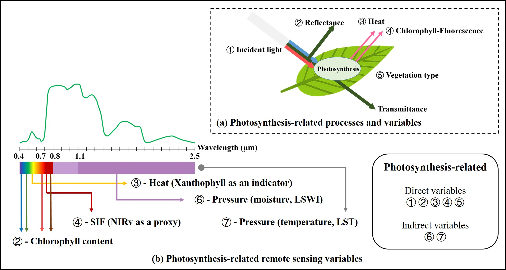
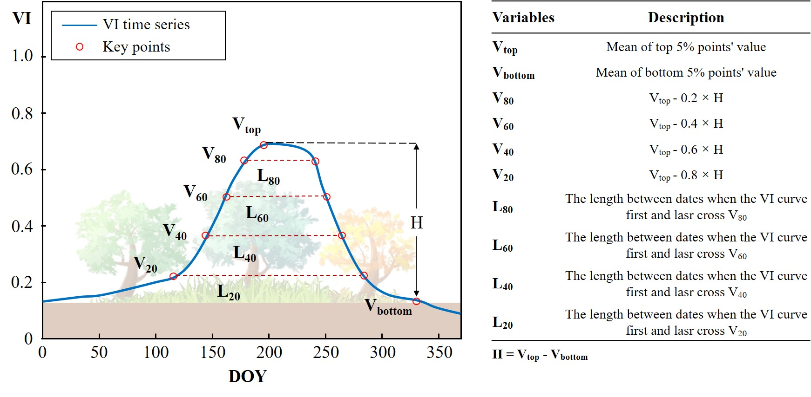
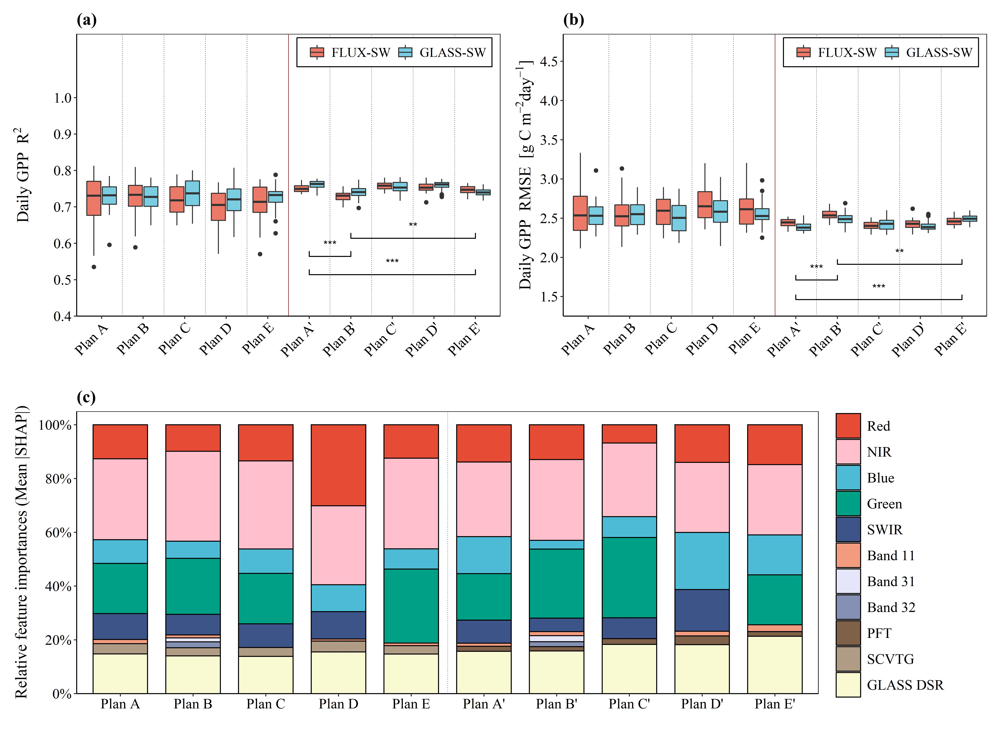
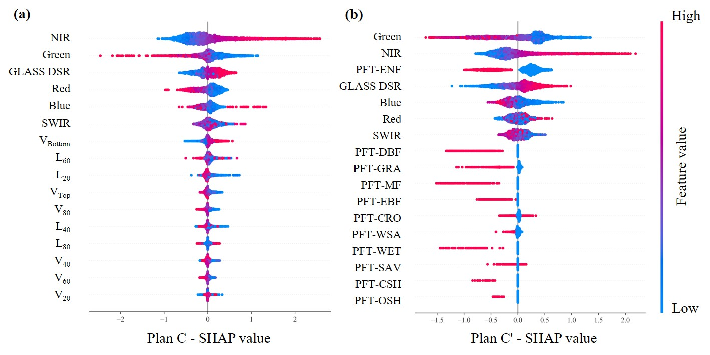

# A framework for GPP estimation devoid of meteorological and land cover data
Almost all existing remote sensing models (e.g., regression models, parametric models, process models and machine learning models) rely on plant functional type (PFT)-based parameter settings, multiple data sources (e.g., meteorological data) and key indices (e.g., leaf area index, LAI), limiting their estimation accuracy and spatial generalization capability. 
  
Therefore, we developed an End-To-End Satellite-based model (ETES) to improve GPP estimation. ETES only utilizes input variables from original satellite observations and Global Land Surface Satellite (GLASS) downward shortwave radiation data. It replaces the traditional vegetation types data with a set of numeric variables (named as Seasonal Characteristics of Vegetation Types and Growth, SCVTG) derived from the curve of vegetation index time series within each growing cycle.  
## Data Description
We provide an example dataset containing processed site records from 2010 to 2014. These flux observations from FLUXNET 2015 were paired with remote sensing data. We construct the ETES model for GPP estimation in multi-layer perceptron method (MLP), and it contains a dataset file, model file and example code.
* ETES-MLP

## Highlights
* We developed an end-to-end satellite-based GPP estimation model (ETES), lessening the reliance on multiple data sources. 
* We designed a new plant continuous variable set, named as Seasonal Characteristics of Vegetation Types and Growth (SCVTG). 
* SCVTG can reflect the continuous spatiotemporal differences in plant functional types and phenology. 
* ETES is free from plant functional types, meteorological data and traditional parameters.
* ETES can improve the GPP estimation accuracy, with an average 27.89% reduction of RMSE (monthly scale) compared to similar GPP products. 

## Photosynthesis-related influencing factors and their remote sensing indicators

    
     
    

(a) Photosynthesis-related process and variables. It shows a concept of photosynthesis at the leaf scale, and the upward light (reflectance, heat dissipation and SIF) contains the information catchable for satellite. (b) Photosynthesis-related remote sensing variables. It shows the corresponding bands for monitoring terrestrial photosynthesis. SIF, solar-induced chlorophyll fluorescence; NIRv, a vegetation index equal to NIR × NDVI.
  	

## SCVTG
This a conceptual example showing the SCVTG (Seasonal characteristics of vegetation types and growth) variable set. The SCVTG could characterize the differences in vegetation types and phenology
  

## Pre-experiment for screening optimal features
Comparison of each combination scheme during the screening experiment. (a) The R2 comparison of daily GPP estimation; (b) the RMSE comparison of daily GPP estimation; and (c) the comparison of relative feature importance among schemes. Each scheme contains different input variables. The red boxes (FLUX-SW) represent schemes using shortwave radiation data from flux observations, and the blue boxes (GLASS-SW) represent schemes using shortwave radiation data from remote sensing products. The symbol *, **, *** shows the significance level of t-test between two schemes (e.g., Plan A' vs. Plan B') at the 0.05, 0.01 and 0.001 level, respectively. The relative feature importance (showed with the area) is calculated with each input variable’s mean |SHAP|. Note the differences between SCVTG-based schemes (Plan A, B, C, D, E) and PFT-based schemes (Plan A', B', C', D', E'), and the differences between the FLUX-SW schemes and the GLASS-SW schemes.
  

## Comparison of each input variables’ contribution to GPP estimation between

    
     
    

(a) The SHAP value of each input variable in Plan C (based on SCVTG). (b) The SHAP value of each input variable in Plan C' (based on PFTs). For these two figures, each sample would draw a point in all input variables. The variables were arranged from top to bottom according to the value of mean |SHAP| which means the average contribution or feature importance for GPP estimation. The color of point represents the feature value of each variable in a single sample (e.g., for PFT-ENF, the highest value “1” is red, and the lowest value “0” is blue). The x-axis, SHAP value, means how much degree would each variable’s marginal variation affect the estimation result. SHAP value above 0 represents positive influence, while SHAP value below 0 represents negative influence. Note the similar performances between SCVTG variables and reflectance bands in (a) and the different performances between PFTs and reflectance bands in (b). For example, the higher VBottom value would cause the higher GPP estimation, similar to NIRv (higher NIRv can also get higher GPP). On the contrary, PFTs has just one fixed feature value but response differently in GPP estimation (e.g., all the red points of PFT-DBF equals “1”, but their corresponding SHAP value was totally diverse).
  	

## Comparison with existiong models
Comparison of the overall GPP accuracies at different temporal scales. 8 daily comparison: (a) MOD17, (b) GOSIF, (c) Fluxcom, and (d) ETES. Monthly comparison: (e) MOD17, (f) GOSIF, (g) GPP-NIRv, (h) Fluxcom, and (i) ETES. Yearly comparison: (j) MOD17, (k) GOSIF, (l) GPP-NIRv, (m) Fluxcom, and (n) ETES. The blue–purple color indicates a lower scatter density, while the yellow–green color indicates a higher scatter density.
  

  
Comparison of GPP time series in different models for 10 typical sites with different vegetation types. Each point represent an 8 daily GPP estimation (red color, models’ result) or an 8 daily GPP observation (blue color, FLUXNET). (a) MOD17 vs. FLUXNET, (b) GOSIF vs. FLUXNET, (c) Fluxcom vs. FLUXNET, (d) ETES vs. FLUXNET. CRO: cropland, DBF: deciduous broad-leaf forest, EBF: evergreen broad-leaf forest, ENF: evergreen needle-leaf forest, MF: mixed forest, GRA: grassland, OSH: open shrub, SAV: savanna, WSA: Woody Savanna, WET: wetland.
