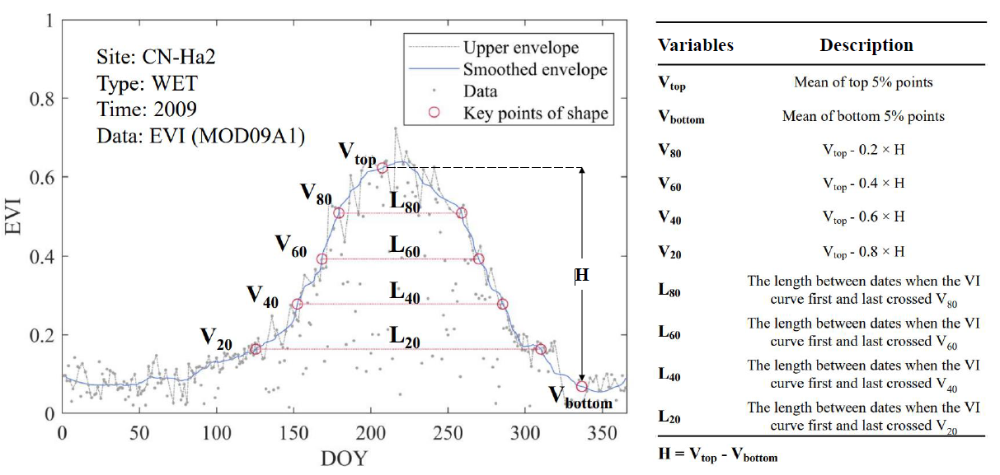
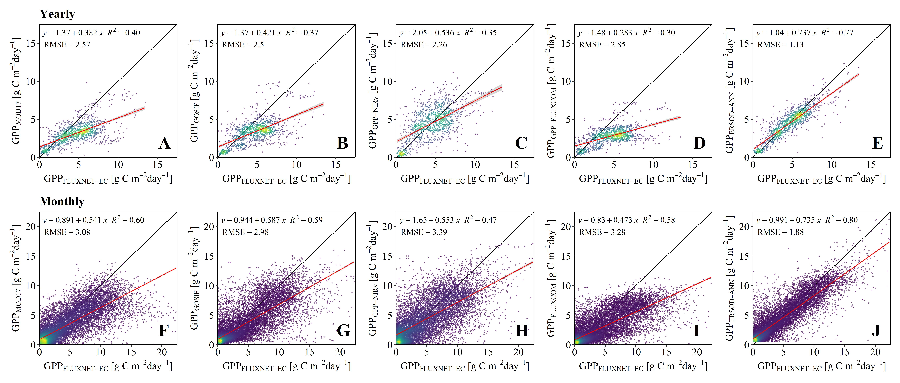

# A new framework for GPP estimation
Almost all existing remote sensing models (e.g., regression models, parametric models, process models and machine learning models) rely on plant functional type (PFT)-based parameter settings and multiple data sources (e.g., meteorological data), limiting their estimation accuracy and spatial generalization capability.
  
To lessen the reliance on multisource data, we developed a new machine learning model for GPP estimation based entirely on remote sensing observation data (ERSOD). ERSOD is also free of PFTs and related parameter settings since it adopts a newly designed plant continuous variable set (PCVS) that is derived from the vegetation index time series of a vegetation growing cycle and can reflect the continuous spatiotemporal differences in plant functional types and phenology. 
## Data Description
We provide an example dataset containing processed site records from 2010 to 2014. These flux observations from FLUXNET 2015 were paired with remote sensing data via 5 × 5 grids (250 m). We construct the ERSOD model for GPP estimation in 3 algorithms (ANN, RF, SVR), as well as each model contains a dataset file, model file and example code.
* ERSOD-ANN
* ERSDO-RF 
* ERSOD-SVR
## Highlights
* We developed a new GPP estimation method based entirely on remote sensing observation data (ERSOD), lessening the reliance on multiple data sources.
* We designed a new plant continuous variable set (PCVS) that could reflect the continuous spatiotemporal differences in plant functional types and phenology.
* ERSOD is free of plant functional types and related parameter settings.
* ERSOD can effectively improve the GPP estimation accuracy, with an average 43.97% reduction in RMSE compared to similar GPP products.
## PCVS
This an example showing the derivation of the plant continuous variable set (PCVS) from an EVI time-series curve in a whole vegetation growing season. The PCVS could characterize the differences in vegetation types and phenology.
  

## Comparison of the overall GPP accuracies among different models
Yearly comparison: (A) MOD17, (B) GOSIF, (C) GPP-NIRv, (D) FLUXCOM, (E) ERSOD-ANN. Monthly comparison: (F) MOD17, (G) GOSIF, (H) GPP-NIRv, (I) FLUXCOM, (J) ERSOD-ANN. The blue-purple color means a lower scatter density, while the yellow-green color means a higher scatter density.
  

